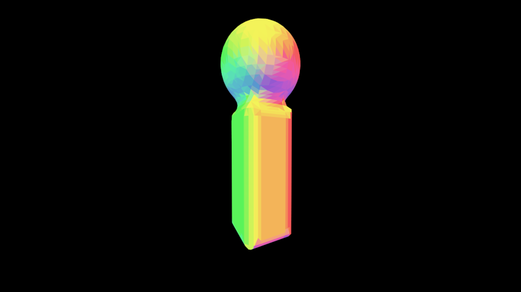
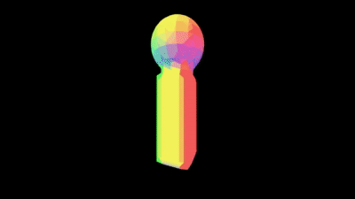

# implicitpipe

OpenGL 3D viewer for [ImplicitCAD](https://github.com/colah/ImplicitCAD).

Allows quick preview of ImplicitCAD `SymbolicObj3` objects by transforming
`NormedTriangleMesh` into format accepted by [GPipe](https://github.com/tobbebex/GPipe-Core).

Based on [GPipe-Test](https://github.com/plredmond/GPipe-Test)

## Build

`nix-build` or `nix-shell & cabal` afterwards.

## Usage

Via `cabal repl`:

```haskell
import Graphics.Implicit
import Graphics.Implicit.Viewer

view $ sphere 10

animate $ \t -> unionR 1 [ sphere 5, cylinder2 1 3 (4 + 5 * t) ]

```

### Animations

Experimental support for animating objects is available - objects
can be parametrized by time variable in `[0..1]` interval
and viewed using `animate` function.

``` haskell
animSample :: Double -> SymbolicObj3
animSample t = sphere (2 + t*2)

animate animSample
```

### Controls

Left mouse button controls camera rotation, scroll wheel zooming,
holding space increases animation speed.

## Executables

Two demo executables are included

 * `implicitview` for testing view functionality
 * `implicitanim` animated variant


## Gallery

### `implicitview`

[](https://raw.githubusercontent.com/sorki/implicitpipe/master/img/i.png)

### `implicitanim`

[](https://raw.githubusercontent.com/sorki/implicitpipe/master/img/anim_smaller.gif)

