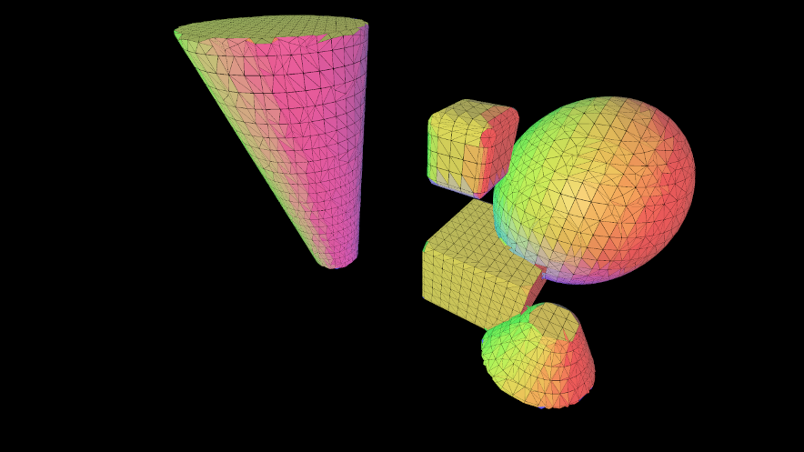
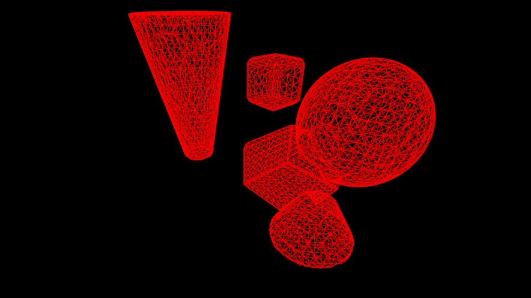
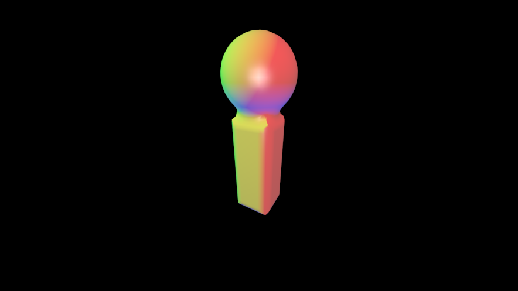

# implicitpipe

OpenGL 3D viewer for [ImplicitCAD](https://github.com/colah/ImplicitCAD).

Allows quick preview of ImplicitCAD `SymbolicObj3` objects by transforming
`NormedTriangleMesh` into format accepted by [GPipe](https://github.com/tobbebex/GPipe-Core).

Based on [GPipe-Test](https://github.com/plredmond/GPipe-Test)

## Build

### With Nix

* `nix-build`
* `./result/bin/implicitview examples-haskell/SomeModule.hs`

or enter development shell using `nix-shell` where you can use
```
cabal run implicitview
```
or `cabal repl`.

### With Stack

* `stack build`
* `stack run implicitview examples-haskell/SomeModule.hs`

## Executables

### `implicitview`

Like [ghcid](https://hackage.haskell.org/package/ghcid) for ImplicitCAD. Features autoreload functionality
that can reload both Haskell modules via [hint](https://hackage.haskell.org/package/hint) or ExtOpenSCAD
files using ImplicitCADs SCAD engine.

Try it on provided examples:

```
implicitview examples-haskell/SomeModule.hs
```

or ExtOpenSCAD variant:

```
implicitview examples-escad/obj.escad
```

While the application is running you can open the source file
in your editor and it will automatically reload the preview on saves.

Haskell loader expects `obj :: SymbolicObj3` variable and optionally
allows changing resolution by also defining `res` variable
(tried types for `res` are `Double`, `Int` and `Integer`).

ExtOpenSCAD loader works with standard `$res` variable. It renders
both 2D and 3D objects by unioning and extruding 2D ones by 1mm.
To achieve the same with Haskell loader, extrude your 2D objects
using `extrudeR 0 (unionR 0 objs2) 1`.

`implicitview` supports viewer configuration via command line, for full list of options see:

```
implicitview --help
```

An example of some parameters:

```
implicitview --rotate  --rotate-init 1 --rotate-step 0.01 --zoom 0.5 example-escad/obj.escad
```

### `implicitanim`

Demo of animation functionality.

## Controls

Left mouse button controls camera rotation, scroll wheel zooming,
holding space increases animation speed.

* `N` or `~` key switches smoothing of normals (off by default)
* `1` .. `0` switches shader
* `Tab` switches to next shader
* `R` toggles autorotation
* `C` toggles autoscaling of object on reloads
* `Q` for quit

## REPL Usage

Via `cabal repl`:

```haskell
import Graphics.Implicit
import Graphics.Implicit.Viewer

view $ sphere 10

animate $ \t -> unionR 1 [ sphere 5, cylinder2 1 3 (4 + 5 * t) ]
```

### Animations

Support for animating objects is available - objects
can be parametrized by time variable in `[0..1]` interval
and viewed using `animate` function.

``` haskell
animSample :: Double -> SymbolicObj3
animSample t = sphere (2 + t*2)

animate animSample
```

Animations are experimental and are currently being reworked
to use composable `Animation` wrapper similar to
[Reanimate.Animation](https://hackage.haskell.org/package/reanimate/docs/Reanimate-Animation.html).

## Gallery

### `implicitview`

[](https://raw.githubusercontent.com/sorki/implicitpipe/master/img/i.png)

### `implicitanim`

[](https://raw.githubusercontent.com/sorki/implicitpipe/master/img/anim_smaller.gif)

### `example-haskell` object with edges shader

[](https://raw.githubusercontent.com/sorki/implicitpipe/master/img/scene_edges.gif)

### `example-haskell` wireframe shader

[](https://raw.githubusercontent.com/sorki/implicitpipe/master/img/scene_wire.gif)

### `demoLetterI` with smoothed normals

[](https://raw.githubusercontent.com/sorki/implicitpipe/master/img/i_smoothed_thumb.png)
